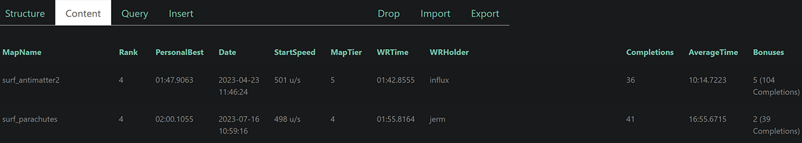

# SneakDBParserCS

## Table of Contents

- [Introduction](#introduction)
- [Features](#features)
- [Supported Gamemodes](#supported-gamemodes)
- [Prerequisites](#prerequisites)
- [Installation](#installation)
- [Instructions](#instructions)
- [Example](#example)
- [Credits](#credits)
- [License](#license)

## Introduction
SneakDBParserCS is a highly-efficient Python script designed to help you organize and manage your Counter-Strike surf times. This tool lets you extract your database information from Sneak's Counter-Strike Database conveniently via an HTML file. It offers two distinct methods for exporting your data, as *Comma Separated Values (**.csv**)* files, and as a *SQLite Database (**.db**)*. With SneakDBParserCS, viewing and analyzing your surf times has never been easier!

## Features
- **Web Scraping**: The script uses BeautifulSoup to scrape the parse data from the user's Sneak's Counter-Strike Database profile.
- **Data Parsing**: It accurately parses the scraped data into usable information such as Map Records, Map Times, Map Tier, and Bonus Times, and more!
- **Dynamic Data Export**: The script provides an option to export the parsed data into various formats such as CSV and SQLite Database, or both. 
- **Local Webfront**: Allows the user to locally host a WebGUI to display, modify and query their database!

## Supported Gamemodes
- **CS:GO Surf**

## Prerequisites
Before you begin, ensure you have met the following requirements:
* You have a `Windows` machine running [Python 3.5](https://www.python.org/downloads/) or later.
  * When installing, check-marking the box `ADD TO PATH` is recommended.

## Installation
1. * Download `.zip`
      
     **OR**
      
   * Clone the repository using `git clone https://github.com/Ahrimdon/SneakDBParserCS.git`.

2. Navigate to the directory using `cd SneakDBParserCS`.

3. Run the setup using the command `setup.py`.

## Instructions
Follow the steps below to use the SneakDBParserCS:

#### **Using the Python Script**
1. **Step 1:** Navigate to the repository using `cd SneakDBParserCS`.

2. **Step 2:** Run `builddb.py` to build the initial database.

> ***Note:*** It is only necessary to run `builddb.py` during first installation, and when updating the database.

3. **Step 3:** Execute `main.py` and enter the URL to your profile for SneakSrvDB (e.g. https://snksrv.com/surfstats/?view=profile&id=YOURSTEAMID).

4. **Step 4:** Choose what you wish to save your Database entries as `(.csv, .db, both)`.

> ***Note:*** If you already have a `surf_db.html` it will first ask if you wish to use it or overwrite it.

4. **Step 5:** Your DB entries will then be saved in a folder named `export`.

5. **Step 6:** Run `parse.py` to parse the all of the general entries into your own. 

5. **Step 7 (Optional):** To view, query, and sort your database with ease, run the batch file `StartWebfront.bat`. To see your database, visit `http://127.0.0.1:7890/` or `http://localhost:7890/`. From here you can view, sort, query entries and ***much*** more!.

## Example

## Credits
- Creator - **Ahrimdon**

- Main Tester - **PandaMane**

## License
Distributed under the MIT License. See `LICENSE` for more information.